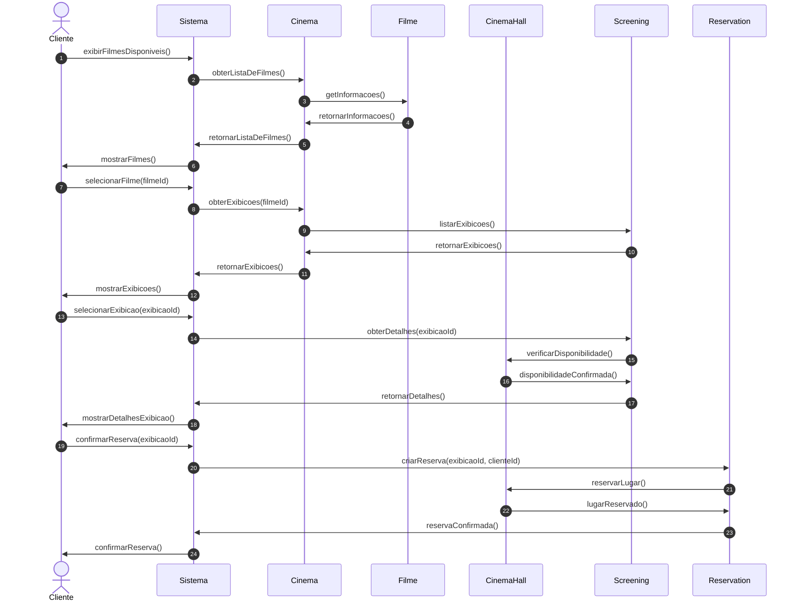

```mermaid
sequenceDiagram
    autonumber
    actor Cliente
    participant Sistema
    participant Cinema
    participant Filme
    participant CinemaHall
    participant Screening
    participant Reservation

    Cliente ->> Sistema: exibirFilmesDisponiveis()
    Sistema ->> Cinema: obterListaDeFilmes()
    Cinema ->> Filme: getInformacoes()
    Filme ->> Cinema: retornarInformacoes()
    Cinema ->> Sistema: retornarListaDeFilmes()
    Sistema ->> Cliente: mostrarFilmes()

    Cliente ->> Sistema: selecionarFilme(filmeId)
    Sistema ->> Cinema: obterExibicoes(filmeId)
    Cinema ->> Screening: listarExibicoes()
    Screening ->> Cinema: retornarExibicoes()
    Cinema ->> Sistema: retornarExibicoes()
    Sistema ->> Cliente: mostrarExibicoes()

    Cliente ->> Sistema: selecionarExibicao(exibicaoId)
    Sistema ->> Screening: obterDetalhes(exibicaoId)
    Screening ->> CinemaHall: verificarDisponibilidade()
    CinemaHall ->> Screening: disponibilidadeConfirmada()
    Screening ->> Sistema: retornarDetalhes()
    Sistema ->> Cliente: mostrarDetalhesExibicao()

    Cliente ->> Sistema: confirmarReserva(exibicaoId)
    Sistema ->> Reservation: criarReserva(exibicaoId, clienteId)
    Reservation ->> CinemaHall: reservarLugar()
    CinemaHall ->> Reservation: lugarReservado()
    Reservation ->> Sistema: reservaConfirmada()
    Sistema ->> Cliente: confirmarReserva()

```

